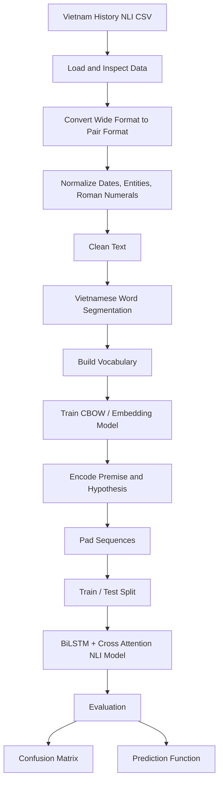

<h1 align="center">Natural Language Inference for Vietnamese History</h1>

<p align="center">
  <b>Vietnamese NLI pipeline for classifying historical sentence pairs into entailment, contradiction, and neutral</b>
</p>

<p align="center">
  
  
  
  
  
</p>

## Overview

This project builds a Vietnamese Natural Language Inference (NLI) pipeline for the domain of Vietnamese history. Given a `premise` sentence and a `hypothesis` sentence, the model predicts whether the hypothesis is:

- `entailment`: logically supported by the premise.
- `contradiction`: conflicts with the premise.
- `neutral`: related but not directly inferred from the premise.

The repository contains notebooks for data exploration, preprocessing, Vietnamese word segmentation, vocabulary construction, CBOW/Skip-gram style embedding experiments, and NLI model training with BiLSTM attention.

## Problem

Vietnamese historical text contains many named entities, dates, periods, abbreviations, and event descriptions. This project focuses on a supervised NLI task:

- Input: a pair of Vietnamese sentences, `premise` and `hypothesis`.
- Output: one of three labels: `entailment`, `contradiction`, or `neutral`.
- Objective: train a model that can identify semantic relationships between Vietnamese historical facts.

Example:

| Premise | Hypothesis | Label |
|---|---|---|
| Ngày 22 tháng 12 năm 1944, Võ Nguyên Giáp thành lập một trung đội 34 người mang tên Việt Nam Tuyên truyền Giải phóng quân | Việt Nam Tuyên truyền Giải phóng quân được thành lập vào ngày 22/12/1944 | entailment |
| Việt Nam Tuyên truyền Giải phóng quân là một trong những tiền thân của Quân đội Nhân dân Việt Nam | Việt Nam Tuyên truyền Giải phóng quân không có bất kỳ mối liên hệ nào với Quân đội Nhân dân Việt Nam | contradiction |

## Pipeline Architecture



## Dataset

The main dataset is:

```text
data_tk1_NLI_VietnamHistory.csv
```

The original file uses a wide format:

| Column | Description |
|---|---|
| `premise` | Historical fact or event sentence |
| `contradiction` | Hypothesis that contradicts the premise |
| `entailment` | Hypothesis entailed by the premise |
| `neutral` | Related but not inferable hypothesis |

Dataset statistics:

| Item | Value |
|---|---:|
| Original rows | 2,239 |
| Hypotheses per premise | 3 |
| Final NLI sentence pairs | 6,717 |
| Labels | `contradiction`, `entailment`, `neutral` |

## Detailed Workflow

### 1. Exploratory Data Analysis

Notebook: `analysis-data.ipynb`

This notebook explores the raw dataset with:

- Number of original rows and generated NLI pairs.
- Label distribution.
- Sentence length distributions.
- Top frequent words.
- WordCloud visualization.
- Sentence similarity analysis with `sentence-transformers`.
- t-SNE visualization of sentence embeddings.

### 2. Data Processing

Notebook: `data-processing.ipynb`

The preprocessing notebook converts the dataset into standard NLI format:

```text
premise, hypothesis, label
```

It also contains normalization functions for:

- Extra spaces.
- Full dates such as `22/12/1944`, `22-12-1944`, and `ngày 22 tháng 12 năm 1944`.
- Partial dates such as `tháng 8 năm 1990`.
- Year and historical period expressions.
- Special characters while preserving useful historical/legal symbols.
- Named entities and abbreviations.
- Roman numerals such as `XI`, `XII`, `XIII`.

The label mapping used in this notebook is:

| Label | ID |
|---|---:|
| contradiction | 0 |
| neutral | 1 |
| entailment | 2 |

### 3. Vietnamese Tokenization and Embedding

Notebook: `embedding.ipynb`

The project experiments with Vietnamese tokenization tools:

- `underthesea`
- `VnCoreNLP`
- `pyvi`

The notebook builds a vocabulary from tokenized sentences, encodes text into index sequences, and trains word representations using CBOW-style context-target pairs.

### 4. NLI Model Training

Notebook: `model-nlp-tk1.ipynb`

The main NLI notebook includes:

- Date normalization pipeline.
- Text cleanup.
- Word segmentation with `VnCoreNLP`.
- Vocabulary construction with `<PAD>` and `<UNK>` tokens.
- CBOW embedding with attention.
- Sequence padding with `max_len = 60`.
- Train/test split with `test_size = 0.2`.
- BiLSTM-based NLI models with cross attention.
- Confusion matrix visualization.
- `predict_nli()` function for direct inference on new sentence pairs.

## Models Used

### CBOW Attention Embedding

The embedding model learns word vectors from context windows. The best checkpoint is saved as:

```text
cbow_attention_best.h5
```

The notebook uses:

- `Embedding`
- `Dense`
- `Softmax`
- Attention-weighted embedding aggregation
- `EarlyStopping`
- `ModelCheckpoint`

### BiLSTM NLI with Cross Attention

The main NLI model encodes premise and hypothesis sequences using a shared bidirectional LSTM encoder. Cross attention is computed between the two encoded sequences, then pooled and classified into three labels.

The best NLI checkpoint is saved as:

```text
best_nli_model.h5
```

## Experimental Results

Results extracted from the training notebooks:

| Model / Experiment | Test Loss | Test Accuracy |
|---|---:|---:|
| BiLSTM baseline experiment | 0.2009 | 92.04% |
| BiLSTM cross-attention experiment | 0.3606 | 86.01% |
| Model 3: trainable CBOW embedding + BiLSTM cross attention | 0.2766 | 89.96% |
| Additional recorded evaluation | 0.3080 | 88.10% |

The strongest recorded test accuracy in the notebooks is approximately **92.04%**.

## Prediction Examples

The final notebook includes prediction examples such as:

```python
predict_nli(
    "Võ Nguyên Giáp thành lập Quân đội nhân dân Việt Nam",
    "Quân đội Việt Nam do Võ Nguyên Giáp thành lập"
)
```

```python
predict_nli(
    "Việt Nam tuyên bố độc lập năm 1945",
    "Việt Nam vẫn là thuộc địa của Pháp"
)
```

```python
predict_nli(
    "Chủ tịch Hồ Chí Minh sinh ngày 19 tháng 5 năm 1890 tại xã Kim Liên, huyện Nam Đàn, tỉnh Nghệ An.",
    "Hồ Chí Minh sinh năm 1890 tại Nghệ An."
)
```

## Folder Structure

```text
.
|-- analysis-data.ipynb
|-- data-processing.ipynb
|-- embedding.ipynb
|-- model-nlp-tk1.ipynb
|-- data_tk1_NLI_VietnamHistory.csv
|-- Báo cáo.pptx
`-- README.md
```

## Installation

The notebooks were prepared for a Kaggle/Colab-style environment. A local Python environment can be created with:

```bash
python -m venv .venv
source .venv/bin/activate
pip install -U pip
pip install pandas numpy matplotlib seaborn wordcloud scikit-learn sentence-transformers tensorflow torch jupyter
pip install underthesea pyvi vncorenlp py_vncorenlp
```

On Windows PowerShell:

```powershell
python -m venv .venv
.\.venv\Scripts\Activate.ps1
pip install -U pip
pip install pandas numpy matplotlib seaborn wordcloud scikit-learn sentence-transformers tensorflow torch jupyter
pip install underthesea pyvi vncorenlp py_vncorenlp
```

## Quick Start

### 1. Open Jupyter Notebook

```bash
jupyter notebook
```

### 2. Run the Notebooks in Order

Recommended order:

```text
analysis-data.ipynb
data-processing.ipynb
embedding.ipynb
model-nlp-tk1.ipynb
```

### 3. Update Dataset Paths

Several notebooks use Kaggle paths such as:

```python
"/kaggle/input/datasets/thnhtrungnguynmif/vietnamhistory-nli/data_tk1_NLI_VietnamHistory.csv"
```

When running locally, replace them with:

```python
"data_tk1_NLI_VietnamHistory.csv"
```

### 4. Run Inference

After training the final model in `model-nlp-tk1.ipynb`, use:

```python
predict_nli(premise, hypothesis)
```

## Expected Outputs

After running the notebooks, expected outputs include:

- Cleaned NLI dataset in pair format.
- Tokenized Vietnamese sentences.
- Vocabulary mapping.
- CBOW embedding matrix.
- NLI model checkpoints.
- Training and validation curves.
- Test loss and test accuracy.
- Confusion matrix.
- Direct prediction examples.

## Highlights

- End-to-end Vietnamese NLI workflow.
- Domain-specific dataset about Vietnamese history.
- Converts wide-format labeled hypotheses into standard NLI pairs.
- Handles Vietnamese date expressions and historical named entities.
- Compares Vietnamese tokenization approaches.
- Uses CBOW-style embeddings and BiLSTM attention for NLI classification.
- Includes presentation material in `Báo cáo.pptx`.

## Current Limitations

- The project is notebook-based and not yet refactored into reusable Python modules.
- Some notebook paths are Kaggle-specific and need adjustment for local execution.
- No `requirements.txt` file is currently included.
- Generated model checkpoints are referenced in notebooks but not included in the repository.
- The dataset is domain-specific, so performance may not transfer to general Vietnamese NLI data.

## Future Work

- Add `requirements.txt` or `environment.yml`.
- Refactor preprocessing, tokenization, training, and inference into Python scripts.
- Add a single training pipeline script.
- Add saved model files or release checkpoints.
- Add a small demo app for entering premise and hypothesis.
- Evaluate on an external Vietnamese NLI benchmark.
- Compare with transformer-based Vietnamese models such as PhoBERT.

## Project Materials

```text
Báo cáo.pptx
```

The PowerPoint file contains the project report/presentation material for the Vietnamese History NLI system.

## License

No license file is currently declared in this repository. If this project is published publicly, consider adding a `LICENSE` file so others know how the dataset, notebooks, and results may be used.
